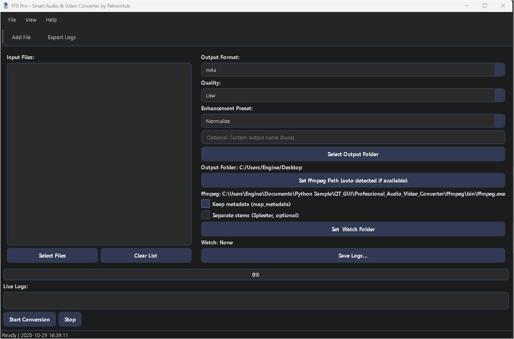
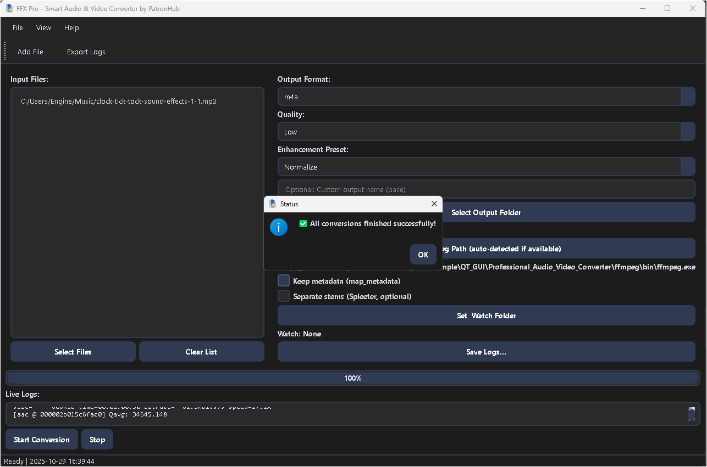
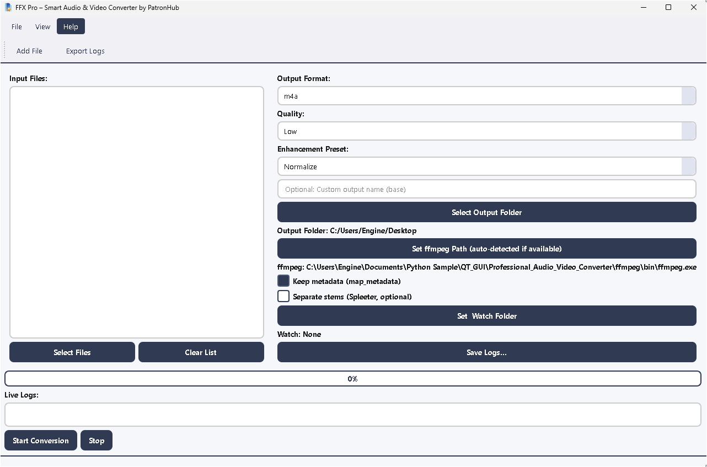

# FFX Pro Audio Video Converter

 

A professional, modular, and efficient **Audio & Video Converter** built using Python and PyQt5. FFX Pro supports multi-threaded media conversions, dark/light themes, and folder watching powered by FFmpeg.

---

## 📂 Project Structure

```
FFX_PRO_Audio_Video_Converter/
├── assets/                      # Project assets like icons and screenshots
│   └── screenshots/             # Screenshots for README and documentation
├── modules/                     # Modular backend files
│   ├── converter_thread.py      # Handles conversion logic (threaded)
│   ├── utils.py                 # Helper functions for file and path operations
│   └── watcher.py               # Folder watcher and event handler
├── resources_rc.py              # Compiled Qt resource file (.qrc)
├── ffx_pro.py                   # Main UI class (refactored and organized)
├── main.py                      # Application entry point
├── README.md                    # This file
├── LICENSE                      # MIT License
└── requirements.txt             # Python dependencies
```

---

## ⚡ Features

* **FFmpeg-Powered Conversion**: Convert audio and video formats seamlessly.
* **Multi-threaded Execution**: UI remains responsive during long conversions.
* **Drag-and-Drop Support**: Add files directly into the converter.
* **Folder Watcher**: Automatically detects and adds new media files.
* **Dark/Light Theme Toggle**: Switch UI modes instantly.
* **Persistent Settings**: Saves theme, window size, and last used directory.
* **Modular Codebase**: Each component separated for maintainability.

---

## 🖼 Screenshots

**Main Converter Window:**



**Dark Theme:**



**Light Theme:**



---

## 🚀 Installation

1. Clone the repository:

```bash
git clone https://github.com/j3fcruz/FFX_PRO_Audio_Video_Converter.git
cd FFX_PRO_Audio_Video_Converter
```

2. Create a virtual environment (recommended):

```bash
python -m venv venv
source venv/bin/activate  # Linux/Mac
venv\Scripts\activate     # Windows
```

3. Install dependencies:

```bash
pip install -r requirements.txt
```

4. Run the application:

```bash
python main.py
```

> **Note:** Make sure FFmpeg is installed and added to your system PATH.

---

## 📝 Usage

1. **Add File(s)**: Use the toolbar or drag-and-drop into the main window.
2. **Select Output Format**: Choose desired audio/video format (MP3, MP4, WAV, etc.).
3. **Start Conversion**: Click the *Convert* button — conversion runs in a background thread.
4. **Monitor Progress**: Watch progress updates in the status bar.
5. **Auto Import**: Enable folder watcher to auto-detect new media.

---

## ⚙ Dependencies

```text
PyQt5>=5.15.7
ffmpeg-python>=0.2.0
watchdog>=3.0.0
```

Install via pip:

```bash
pip install -r requirements.txt
```

---

## 🧠 Modules Overview

| Module                  | Description                                                    |
| ----------------------- | -------------------------------------------------------------- |
| **converter_thread.py** | Handles FFmpeg-based conversions in a background thread        |
| **utils.py**            | Provides file management, formatting, and validation utilities |
| **watcher.py**          | Implements file monitoring using the Watchdog library          |
| **ffx_pro.py**          | GUI layout, signal wiring, and settings persistence            |
| **main.py**             | Initializes the main application window                        |

---

## 🎨 Themes

Available under `assets/themes/`:

* **dark.qss** — Modern dark interface for professionals.
* **light.qss** — Clean and minimal for better daylight visibility.

Switch via **View → Theme** in the menu.

---

## 🛠 Contributing

1. Fork the repository.
2. Create a new branch: `git checkout -b feature/YourFeature`.
3. Make your changes.
4. Commit: `git commit -m 'Add YourFeature'`.
5. Push: `git push origin feature/YourFeature`.
6. Submit a Pull Request.

> Follow PEP8 style and modular conventions.

---

## 📜 License

This project is licensed under the **MIT License**. See the [LICENSE](LICENSE) file for more information.

---

## 👤 Author

**PatronHub Development Team**
GitHub: [@j3fcruz](https://github.com/j3fcruz) 
Ko-fi: [@marcopolo55681](https://ko-fi.com/marcopolo55681)

💰 PayPal: [@jecfcruz](https://paypal.me/jofreydelacruz13)  

🪙 Crypto: BTC 1BcWJT8gBdZSPwS8UY39X9u4Afu1nZSzqk,ETH xcd5eef32ff4854e4cefa13cb308b727433505bf4

---

## 🔑 Notes

* Supports only files compatible with FFmpeg.
* Conversion speed depends on your hardware and codec type.
* All paths and operations are validated for safety.

---

Empower your workflow with **FFX Pro — the next-generation PyQt5 Audio Video Converter**.
